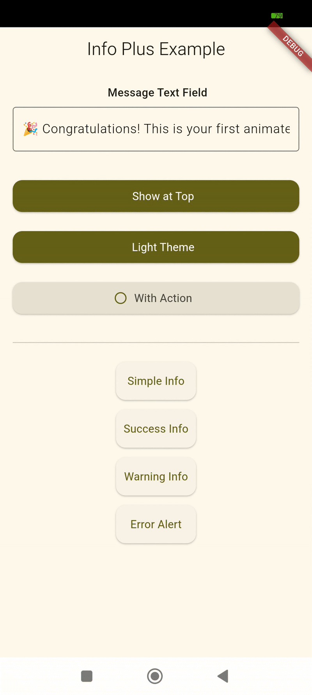
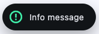
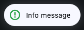
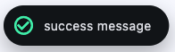
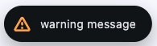
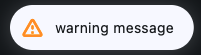
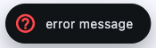
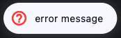

## Info PLus

is an animated alert info to replace default snack bar



## Installation

Add `info_plus` to your `pubspec.yaml` as a dependency

```yaml
dependencies: info_plus:0.0.1
```

## Usage

Import the package

```dart
import 'package:info_plus/info_plus.dart';
```

To display an alert

```dart
InfoPlus.show(
    context: context,
    text: 'Message to be displayed',
);
```

### TypeInfo (Optinal)

Different type of alert to change the icon and color

- TypeInfo.info
- TypeInfo.success
- TypeInfo.warning
- TypeInfo.error

to change the type of alert use `typeInfo` param

```dart
InfoPlus.show(
    context: context,
    text: 'Message to be displayed',
    typeInfo: TypeInfo.success,
);
```

|         | Light theme                                        | Dark theme                                        |
| ------- |----------------------------------------------------|---------------------------------------------------|
| info    |      |      |
| success |  |   |
| warning |  |  |
| error   |    |    |

or change the icon by passing the `icon` as IconData

```dart
InfoPlus.show(
    context: context,
    text: 'Message to be displayed',
    icon: Icons.person,
);
```

to change the icon color use `iconColor`

```dart
InfoPlus.show(
    context: context,
    text: 'Message to be displayed',
    icon: Icons.person,
    iconColor: Colors.amber,
);
```

### Alert position and padding (Optinal)

by default the alert apear from the top, to diplsay the alert from bottom use `position` parm `MessagePosition.bottom`

```dart
InfoPlus.show(
    context: context,
    text: 'Message to be displayed',
    position: MessagePosition.bottom,
);
```

the `padding` param is use to indicate the exact padding from top if the alert is `MessagePosition.top` or bottom padding if is `MessagePosition.bottom`

### Alert with Action (Optinal)

To add action use `action` as string and `actionCallback` as function

```dart
InfoPlus.show(
    context: context,
    text: 'Message to be displayed',
    action: 'Cancel',
    actionCallback: () {
        //Handle action on callback
    },
);
```

### Decortaion (Optinal)

The default color depend of ThemeMode of the Widget.
if the current ThemeMode is `Light`the alert use dark theme. Otherwise use light theme.

- `backgroundColor` : to change the backgroud color of alert by default is surface color of opposite theme.
- `textColor` : the text color of the message by default is onSurface color of opposite theme.
- `actionColor` : the text color of the action by default is TextButton color color of opposite theme.

### Duration and dismiss (Optinal)

`duration` : The duration in seconde for alert will be display by default 3 seondes

to dispose the alert swipe the widget on horizantal direction.

## Contributing

Pull requests are welcome. For major changes, please open an issue first
to discuss what you would like to change.

## License

[MIT](https://choosealicense.com/licenses/mit/)
